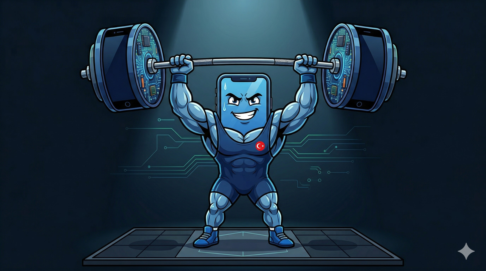

# 🏋️ NAIM Challenge



**Naim Agentic Iterative Mobile** — Küçük telefon, dev güç.

> *"We don't build apps. We evolve them."*

---

## What is NAIM?

NAIM adapts the [Karpathy autoresearch loop](https://github.com/karpathy/autoresearch) for mobile app development. Instead of an AI agent optimizing ML training overnight, **you** are the agent iterating on a mobile app — one small feature per cycle.

The autoresearch pattern has 3 primitives:
1. **Editable asset** → your mobile app codebase
2. **Scalar metric** → feature count (kg lifted)
3. **Time-boxed cycle** → 15 min per iteration

Each iteration = one "lift." You describe what you want, AI builds it, you test it, you log it. Repeat.

---

## 🛠️ Toolchain

| Tool | Role | Cost |
|------|------|------|
| [Google Stitch](https://stitch.withgoogle.com) | AI design canvas → UI mockups from text/voice | Free (350 gen/month) |
| [Google Antigravity](https://antigravity.google/download) | Agent-first IDE → code generation from prompts | Free (rate-limited) |
| [Stitch MCP](https://github.com/davideast/stitch-mcp) | Bridge: Stitch designs → Antigravity code | Free |
| GitHub | Version control + iteration log | Free |

**Alternative paths** (if Antigravity credits run out):
- a0.dev → React Native component generation
- Claude Code CLI → prompt-based code generation
- Cursor → AI-enhanced editor

---

## 🔁 The NAIM Loop

```
┌─────────────────────────────────────────────┐
│                                             │
│   1. THINK   → What feature to add? (2 min)│
│   2. DESIGN  → Stitch: voice/text → UI     │
│   3. CODE    → Antigravity: implement       │
│   4. TEST    → Does it work? Screenshot.    │
│   5. LOG     → Write in MOBILE.md           │
│   6. COMMIT  → Push to GitHub               │
│                                             │
│   ← Repeat (15 min per cycle) ←             │
└─────────────────────────────────────────────┘
```

---

## 🏋️ Weight System

Every feature = weight (kg). Your app "lifts" more as it grows.

| Feature | Weight |
|---------|--------|
| Basic UI screen | 5 kg |
| Text input/output | 10 kg |
| Image support | 10 kg |
| Dark mode | 5 kg |
| Navigation (multi-screen) | 15 kg |
| API call (external data) | 20 kg |
| Local storage / cache | 20 kg |
| AI feature (chat, summary, etc.) | 25 kg |
| Voice input | 15 kg |
| Camera integration | 15 kg |
| Custom animation | 10 kg |
| Push notification (simulated) | 10 kg |
| Search functionality | 10 kg |

**Total lifted = sum of all features committed.**

---

## 🚀 Quick Start

```bash
# 1. Fork this repo
# 2. Clone your fork
git clone https://github.com/YOUR_USERNAME/naim.git
cd naim

# 3. Copy the template
cp MOBILE.template.md MOBILE.md

# 4. Open Stitch → design your first screen
#    https://stitch.withgoogle.com

# 5. Open Antigravity → build it
#    https://antigravity.google/download

# 6. Start iterating. Log everything in MOBILE.md.

# 7. Commit format:
git commit -m "[NAIM: YourCreativeName] Added text messaging - 10kg"
```

---

## 📋 Deliverables

1. **MOBILE.md** — Your iteration log (this is the grade)
2. **Working app** — Screenshots or video proof per iteration
3. **Total weight** — Sum of all features

---

## 🏆 Awards

| Award | Criteria |
|-------|----------|
| 🧠 Most Creative NAIM | Most original feature ideas |
| ⚡ Fastest Lifter | Most iterations in shortest time |
| 🏋️ Heaviest App | Highest total weight |
| 🎯 Cleanest Loop | Best MOBILE.md documentation |
| 🤖 Best AI Collaboration | Most effective AI tool usage |

---

## 📚 References

- [Karpathy autoresearch](https://github.com/karpathy/autoresearch) — The pattern that inspired NAIM
- [Google Stitch](https://blog.google/innovation-and-ai/models-and-research/google-labs/stitch-ai-ui-design/) — AI-native design canvas (updated March 19, 2026)
- [Google Antigravity](https://developers.googleblog.com/build-with-google-antigravity-our-new-agentic-development-platform/) — Agent-first IDE
- [Stitch MCP Server](https://github.com/davideast/stitch-mcp) — Design-to-code bridge
- [Alibaba Page Agent](https://github.com/alibaba/page-agent) — In-page GUI agent (bonus exploration)

---

## 🇹🇷 Neden NAIM?

Naim Süleymanoğlu — "Cep Herkülü." Küçük ama efsane. 
Tıpkı telefonunuzdaki uygulama gibi: küçük başlar, her iterasyonda büyür, sonunda dünya rekoru kırar.

**NAIM = Naim Agentic Iterative Mobile**

---

*AIgile Mobile — Dr. Nurettin Şenyer*
